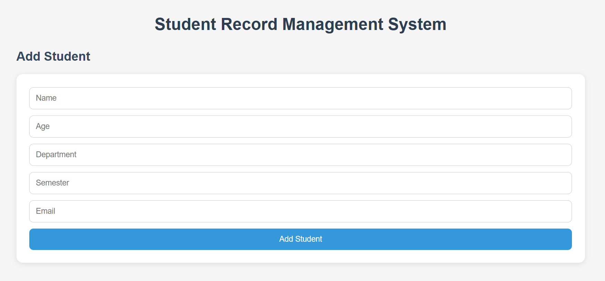
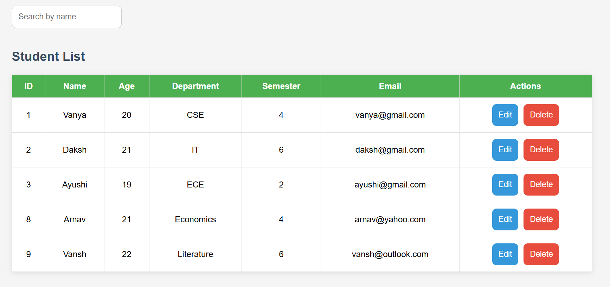

# Student-Record-Management-System

## Project Overview

A full-stack CRUD application for managing student records using React, Node.js, Express, and MySQL.

---

## Features

- Add Student
- Update Student
- Delete Student
- Search Student
- View All Students
- Form Validation
- Responsive UI

## Tech Stack

Frontend

- React + Vite
- Axios
- React Router 

Backend

- Node.js
- Express.js

Database
- MySQL

Tools
- Postman

---

## Folder Structure

```
Student-Record-Management-System/
│
├── client/                         # React Frontend
│   ├── src/
│   │   ├── components/             # Reusable React components
│   │   │   ├── SearchBar.jsx
│   │   │   ├── StudentForm.jsx
│   │   │   ├── StudentList.jsx
│   │   │   └── StudentRow.jsx
│   │   │
│   │   ├── services/               # Axios API configuration
│   │   │   ├── api.js
│   │   │
│   │   ├── App.jsx                 # Main application
│   │   ├── App.css                 # Styling
│   │   ├── index.css
│   │   └── main.jsx
│   │
│   ├── package.json
│   └── vite.config.js
│
├── server/                         # Express Backend
│   ├── config/
│   │   └── db.js                   # MySQL connection
│   │
│   ├── controllers/
│   │   └── studentController.js    # Request handlers
│   │
│   ├── models/
│   │   └── studentModel.js         # Database queries
│   │
│   ├── routes/
│   │   └── studentRoutes.js        # API routes
│   │
│   ├── .env
│   └── server.js                   # Express server
│
├── database/
│   └── student_db.sql              # Database schema
│
└── README.md
```

---

## Installation

### Backend

cd server

npm install

node server.js


### Frontend

cd client

npm install

npm run dev

---

## API Endpoints

GET /students

GET /students/:id

POST /students

PUT /students/:id

DELETE /students/:id

---

## Screenshots





---


